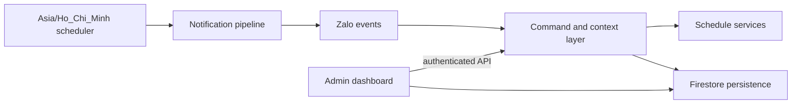

# ZaloBot

ZaloBot is a production-oriented Node.js bot for Lạc Hồng University schedules. It retrieves student, teacher, exam, and room data, persists runtime state in Firestore, delivers scheduled notifications in Vietnam time, and exposes an authenticated administration dashboard.

## Features

- Student, weekly, exam, teacher, and empty-room schedule queries.
- Daily schedule, schedule-change, class-start, and broadcast notifications.
- Per-user and per-chat MSSV context with separate private/group records.
- Firestore-backed persistence with legacy JSON migration support.
- Authenticated admin dashboard and command console backed by the same bot command engine, with multi-recipient command execution.
- Access control, chat health tracking, bounded delivery retries, and operational audit logs.
- File-based Firebase configuration with a single downloaded service-account JSON.

## Architecture



The runtime starts by hydrating Firestore state, then starts the admin HTTP server, the scheduler, and Zalo polling. `recent_json/` is migration input only; it is never authoritative at runtime.

Startup order is fixed so no scheduled work runs on empty state:

```text
load environment
-> initialize Firebase
-> load Firestore state
-> reconcile required state
-> start dashboard
-> start schedulers
-> start Zalo polling
```

If Firebase/Firestore initialization fails, startup stops with a non-zero exit code and neither the scheduler nor Zalo polling is started. Production never falls back to local JSON storage; local JSON remains available for migration and tests only.

## Prerequisites

- Node.js LTS (64-bit recommended) and npm.
- Firebase project with Firestore enabled and a service account with read/write access to the configured state collection.
- Zalo Bot token.
- Optional Gemini API key and Discord webhook.
- Windows Server 2019+, Linux, or another Node.js-supported OS.

## Installation

```bash
git clone https://github.com/NAUTH05/ZaloBot
cd ZaloBot
npm install
```

Create the environment file:

```bash
cp .env.example .env       # Linux/macOS
```

```cmd
copy .env.example .env     REM Windows CMD
```

```powershell
Copy-Item .env.example .env   # PowerShell
```

## Firebase setup

ZaloBot prefers **one downloaded Firebase Admin JSON configuration file**. Separate project/email/key fields are no longer required.

1. Open the [Firebase Console](https://console.firebase.google.com/).
2. Create a project or select an existing one.
3. Open **Firestore Database** in the left menu.
4. Click **Create database**.
5. Select a region and finish creation.
6. Open **Project settings** (gear icon).
7. Open the **Service accounts** tab.
8. Click **Generate new private key** (Firebase Admin SDK configuration file).
9. Download the JSON file.
10. Rename it to:

    ```text
    zalobot-firebase-adminsdk-fbsvc.json
    ```

11. Place it in the project root.

```text
ZaloBot/
├── admin-ui/
├── main.js
├── firestorePersistence.js
├── ecosystem.config.cjs
├── .env
├── .env.example
├── zalobot-firebase-adminsdk-fbsvc.json
├── package.json
└── README.md
```

This local configuration file must stay outside Git. `.gitignore` already excludes `.env`, `firebase-service-account.json`, and every `*firebase-adminsdk*.json` file. Keep the file outside the repository when the host supports it (for example `C:\Secure\ZaloBot\...` or `/etc/zalobot/...`).

The configuration file path supports relative and absolute paths. Relative paths resolve from the project directory, so the bot behaves the same regardless of the directory PM2 is started from:

```js
const configuredPath = process.env.FIREBASE_SERVICE_ACCOUNT_FILE;

const resolvedPath = path.isAbsolute(configuredPath)
    ? configuredPath
    : path.resolve(projectRoot, configuredPath);
```

Before Firebase starts, the file is validated. Clear errors are reported for a missing path, a missing file, invalid JSON, missing required fields, and a Firebase initialization failure. The content of the JSON file is never printed to the logs.

## Environment setup

Firebase example:

```env
FIREBASE_SERVICE_ACCOUNT_FILE=./zalobot-firebase-adminsdk-fbsvc.json
FIREBASE_DATABASE_ID=(default)
FIREBASE_STATE_COLLECTION=bot_state
```

Absolute path examples:

```env
# Linux/macOS
FIREBASE_SERVICE_ACCOUNT_FILE=/home/zalobot/zalobot-firebase-adminsdk-fbsvc.json
```

```env
# Windows
FIREBASE_SERVICE_ACCOUNT_FILE=C:\Secure\ZaloBot\zalobot-firebase-adminsdk-fbsvc.json
```

`FIREBASE_DATABASE_ID` selects the Firestore database. `(default)` uses the default database; any other value selects that named database through the Firebase Admin API. Migration and runtime always use the same project, database, and collection.

### Configuration groups

| Group | Variables |
| --- | --- |
| Zalo | `BOT_TOKEN`, `CHAT_MAX_CONSECUTIVE_FAILURES` |
| Owner IDs | `OWNER_USER_ID`, `OWNER_CHAT_ID` |
| Dashboard | `ADMIN_USERNAME`, `ADMIN_PASSWORD`, `ADMIN_PASSWORD_HASH`, `ADMIN_PORT`, `ADMIN_BASE_PATH`, `ADMIN_COOKIE_SECURE` |
| Discord | `DISCORD_WEBHOOK` |
| Gemini | `GEMINI_API_KEY`, `GEMINI_MODEL` |
| Firebase | `FIREBASE_SERVICE_ACCOUNT_FILE`, `FIREBASE_DATABASE_ID`, `FIREBASE_STATE_COLLECTION` |
| Runtime | `TZ`, `NODE_ENV`, `PORT`, `CLASS_START_GRACE_MS`, `CLASS_START_CACHE_TTL_MS`, `SHUTDOWN_TIMEOUT_MS` |

`OWNER_USER_ID` and `OWNER_CHAT_ID` accept comma-separated identities. `ADMIN_PORT` falls back to `PORT`, then `6003`. `TZ` must remain `Asia/Ho_Chi_Minh`. `SHUTDOWN_TIMEOUT_MS` must stay below the PM2 `kill_timeout`.

### Obtaining owner IDs

1. Start the bot once with any valid `BOT_TOKEN` (owner IDs may be empty at first).
2. Send `/myid` from the account that should be the owner.
3. Copy the returned **User ID** into `OWNER_USER_ID` and the **Chat ID** into `OWNER_CHAT_ID`.
4. Restart the bot.

Owner IDs can also be managed from the dashboard (**Settings -> Admins**) without editing `.env`.

The same Settings panel configures the Command console batch limits: `maxBatchSize` (recipients per run, default 25) and `batchDelayMs` (pause between sends, default 350 ms).

## Development run

```bash
npm start
npm test
npm run build:admin
npm run verify:firebase-admin
```

Useful scripts:

| Script | Purpose |
| --- | --- |
| `npm start` | Run the bot (`node main.js`). |
| `npm test` | Run the Node test suite. |
| `npm run admin:hash-password` | Generate `ADMIN_PASSWORD_HASH` from `ADMIN_PASSWORD_TO_HASH`. |
| `npm run migrate:firestore` | Import `recent_json/` into Firestore. |
| `npm run verify:firebase-admin` | Check Firebase credentials and Firestore access. |
| `npm run build:admin` | Verify the dashboard assets are present. |

There is no build step; the bot runs directly from source.

## Migration

`recent_json/` holds legacy JSON state. Import it once with:

```bash
npm run migrate:firestore
```

The migration uses exactly the same Firebase configuration as the runtime:

```env
FIREBASE_SERVICE_ACCOUNT_FILE=./zalobot-firebase-adminsdk-fbsvc.json
FIREBASE_DATABASE_ID=(default)
FIREBASE_STATE_COLLECTION=bot_state
```

A custom source folder can be passed as an argument:

```bash
node migrateToFirestore.js /path/to/json-folder
```

The migration reports a clear error and exits with a non-zero code when the source folder is missing, a JSON file is invalid, Firebase setup fails, or no JSON file is found.

## PM2 production deployment

```bash
npm install -g pm2

npm install
npm test

pm2 start ecosystem.config.cjs
pm2 status
pm2 logs zalobot
pm2 save
pm2 startup
```

**ZaloBot must run as one process only.** `ecosystem.config.cjs` sets `instances: 1` and `exec_mode: "fork"`. Do not use cluster mode: multiple instances would duplicate Zalo polling, scheduled tasks, notifications, and dashboard listeners.

PM2 settings used by this project:

| Setting | Value | Reason |
| --- | --- | --- |
| `name` | `zalobot` | Stable process name for logs and restarts. |
| `instances` / `exec_mode` | `1` / `fork` | Exactly one runtime, no duplicated polling. |
| `autorestart` / `max_restarts` | `true` / `10` | Automatic recovery with a restart cap. |
| `restart_delay` | `5000` | Avoid tight restart loops. |
| `min_uptime` | `30s` | Treat fast crashes as failed starts. |
| `kill_timeout` | `15000` | Allows pending Firestore writes to flush. |
| `max_memory_restart` | `512M` | Recycle on memory growth. |
| `time` | `true` | Timestamps in PM2 logs. |
| `cwd` | project directory | Relative `.env` and credential paths resolve correctly. |

### Update workflow

```bash
cd /path/to/ZaloBot
git pull
npm install
npm test
pm2 restart zalobot --update-env
pm2 status
pm2 logs zalobot
```

`--update-env` is required after changing `.env`; without it PM2 keeps the previous environment.

### Clean shutdown

The runtime handles `SIGINT` and `SIGTERM` (what `pm2 restart` / `pm2 stop` send). Shutdown runs only once and then:

1. cancels node-schedule jobs;
2. stops Zalo polling when the library exposes a stop API;
3. closes the dashboard HTTP server;
4. awaits `flushPersistenceWrites()`;
5. exits with code `0`, or with code `1` when `SHUTDOWN_TIMEOUT_MS` is exceeded.

## Admin dashboard

The dashboard listens only on `127.0.0.1:${ADMIN_PORT}${ADMIN_BASE_PATH}/` and is protected by an HttpOnly, SameSite session cookie. It provides overview health, chat directory, users and MSSV, subscriptions, command execution, settings, logs, and audit history. The console calls the same backend command engine; it does not duplicate business logic.

Dashboard sessions are kept in memory. A PM2 restart requires signing in again, which is expected.

### Reverse proxy (Nginx / CloudPanel / IIS)

Expose the dashboard through the reverse proxy instead of binding Node to a public interface. Keep the Node process on localhost.

Nginx example:

```nginx
location /zalobot/ {
    proxy_pass http://127.0.0.1:6003/zalobot/;
    proxy_http_version 1.1;
    proxy_set_header Host $host;
    proxy_set_header X-Forwarded-Proto $scheme;
    proxy_set_header X-Forwarded-For $proxy_add_x_forwarded_for;
}
```

- Keep `ADMIN_BASE_PATH` aligned with the proxy location (`/zalobot` by default).
- Keep `ADMIN_COOKIE_SECURE=true` when the dashboard is served over HTTPS.
- The production subdomain is `https://zalobot.mrnauthdev.dpdns.org/`.
- For Windows Server/IIS follow [deployment/windows/README.md](deployment/windows/README.md).

## Firestore data structure

Runtime state is stored as JSON payloads in a single collection (`bot_state` by default), one document per store:

```text
bot_state
├── subscriptions
├── interactions
├── scheduleSnapshots
├── classStartNotifications
├── accessControl
├── chatDirectory
├── adminAudit
├── adminLogs
└── adminSettings
```

Each document stores `{ payload: "<json>", updatedAt: "<iso>" }`. Writes are serialized through a queue and retried three times; failures are surfaced in the dashboard persistence status and in the logs. `flushPersistenceWrites()` awaits the queue and is called during normal shutdown.

`bot_state/dutyScheduleData` is **not** listed above: the Room 411 duty feature was extracted into a separate bot that now owns that document exclusively. This bot neither hydrates nor writes it, and `importJsonDirectory()` skips it so a JSON migration can never overwrite the extracted data. See [Room 411 bot](#room-411-bot-separate-project).

## Help command structure

```text
/help       normal user commands
/helpadmin  management commands (owner only)
```

All help content lives in `helpContent.js` as reusable metadata:

```js
const HELP_COMMANDS = [
    {
        command: "luumssv",
        aliases: ["find"],
        usage: "/luumssv [MSSV]",
        description: "Lưu MSSV để dùng cho các lệnh lịch.",
        examples: ["/luumssv 123000xxx"],
        note: "Lệnh này chỉ lưu MSSV, không tự bật thông báo."
    }
];
```

The same metadata feeds `/help`, `/helpadmin`, the dashboard "Available commands" list, and autocomplete, so documentation cannot drift from the code. Every documented command includes syntax, a short description, at least one example, and a short note when useful.

Both help outputs render each command as one compact, consistent block — usage first, then the description, then `(Ví dụ: ...)` and `(Lưu ý: ...)` when present. Only canonical names are shown; compatibility aliases never appear in chat help:

```text
**/luumssv [MSSV]**
Lưu MSSV để dùng cho các lệnh lịch.
(Ví dụ: /luumssv 123000xxx)
(Lưu ý: Lệnh này chỉ lưu MSSV, không tự bật thông báo.)
```

Blocks are separated by a blank line so the existing `sendMessage()` chunker still splits long help output on entry boundaries.

Public `/help` is grouped by category:

```text
## ZCA Personal Account Provider

An **additional** messaging provider that connects a **personal Zalo account** using
[`zca-js`](https://www.npmjs.com/package/zca-js). It runs **alongside** the official
Zalo Bot Platform bots in the same process, sharing all command, schedule and
notification logic. It does not replace them and it does not lift any official
platform limit.

> **Unofficial integration — read this first.** `zca-js` is not an official Zalo
> SDK. It drives a personal account the way a logged-in client would. Using it can
> carry **account and platform compatibility risk**: behaviour can change without
> notice, and an account may be challenged or restricted. Use it on an account you
> are willing to take that risk with, and prefer a dedicated account over a
> personal one.

### 1. What it is

A provider adapter around `zca-js`. It logs in with a QR code, keeps a session on
disk, listens for incoming messages over a WebSocket and sends replies through the
same personal account.

### 2. How it differs from an official bot

| | Official bot | ZCA personal account |
| --- | --- | --- |
| Platform | Zalo Bot Platform | A normal personal Zalo account |
| Credential | A bot token | A QR-authenticated session (cookie + IMEI + user agent) |
| Identity | `bot1` / `bot2` / `bot3` | `zca:<Zalo UID>` |
| Dashboard card | "Bot chính thức" | "Tài khoản Zalo cá nhân" |
| Limits | Platform limits apply, unchanged | No platform bot quota — it is an ordinary account |
| Stability | Vendor-supported | Unofficial; may break |

The ZCA account is **never** presented as an official bot, and it has no token to
display. It is a separate identity with its own storage namespace, so its users and
chats never mix with bot 1's.

### 3. How to enable it

```env
ZCA_ENABLED=true
ZCA_SESSION_PATH=./data/zca-session
ZCA_AUTO_RECONNECT=true
ZCA_LANGUAGE=vi
# ZCA_DISPLAY_NAME=            # optional label when the account name is unknown
# ZCA_NAME_TIMEOUT_MS=5000     # name lookup timeout; never blocks startup
```

Then install the dependency and start as usual:

```bash
npm install
npm start
```

ZCA is off unless `ZCA_ENABLED` is truthy (`1`, `true`, `yes`, `on`). Disabled, the
official bots behave exactly as before.

### 4. First QR login

1. Start the process. With no saved session the log shows:
   `[ZCA][zca:pending] CẦN QUÉT MÃ QR: ...`
2. Open the admin dashboard → **Tổng quan**. The ZCA card shows
   `Cần quét mã QR` and a **Đăng nhập bằng QR** button.
3. Press it, then scan the displayed code with Zalo on your phone:
   **Cá nhân → Thiết bị đăng nhập → quét mã**.
4. On success the card switches to `Đang hoạt động`, and the log shows
   `[ZCA][zca:<uid>] danh tính: zca:pending → zca:<uid>`.

The QR image lives only in the process memory. It is never written to disk and is
only served through the authenticated admin API. Treat a QR screenshot like a
password.

On a headless VPS the dashboard is the practical way to scan. If you cannot reach
the dashboard, `zca-js` can also write the QR to a file via its `qrPath` option,
but this project does not enable that by default because it leaves a credential
artifact on disk.

### 5. Session persistence

`zca-js` exposes exactly two login paths, and this project uses both:

- `zalo.loginQR(options, callback)` — first-time login. The callback's
  `GotLoginInfo` event yields `{ cookie, imei, userAgent }`.
- `zalo.login(credentials)` — restores that same object on later starts.

The session is written atomically (temp file + rename) so a PM2 restart mid-write
cannot leave a truncated credential file.

### 6. Linux / VPS setup

```bash
mkdir -p ./data/zca-session
chmod 700 ./data/zca-session
```

The session file is written with mode `0600` where the filesystem supports it. On
a shared host, make sure the deploy user is the only one who can read `data/`.

### 7. PM2 restart behaviour

The session is restored automatically after a normal restart. Nothing else is
required:

```bash
pm2 restart zalo-bot
pm2 logs zalo-bot --lines 50   # look for "[ZCA] khôi phục phiên thành công"
```

A session lock (`data/zca-session/session.lock`) prevents two processes from using
the same session at once. A stale lock from a crashed process is reclaimed
automatically on the next start. **Do not run two instances against one session** —
they will disconnect each other.

### 8. Dashboard status

The ZCA card reports the account label, UID, authentication state and runtime
status. Statuses you may see:

| Status | Meaning |
| --- | --- |
| `disabled` | `ZCA_ENABLED` is not set |
| `starting` | Boot in progress |
| `waiting_for_qr` / `authentication_required` | Needs a QR scan |
| `authenticated` | Logged in, listener starting |
| `connected` | Listening for messages |
| `reconnecting` | Dropped, retrying with backoff |
| `disconnected` | Stopped, or retries exhausted |
| `error` | Startup or lock failure |

### 9. Account and session security

- `data/` is in `.gitignore`; **never** commit a session file.
- The session is never logged, never returned by any API, and never rendered in
  the dashboard. Logs and API responses carry only a UID and a presence flag.
- QR login and session clearing sit behind the existing admin authentication.
- The session grants full access to the account. If you suspect it leaked, delete
  `data/zca-session/` and remove the device from Zalo → **Thiết bị đăng nhập**.

### 10. Troubleshooting

| Symptom | Cause and fix |
| --- | --- |
| Stays on `authentication_required` | No valid session. Scan the QR again. |
| `phiên đã lưu không dùng được` | The session expired or was invalidated. It is deleted automatically; log in again. |
| `không giành được khóa phiên` | Another process holds the session lock. Stop the duplicate instance. |
| Messages arrive but nothing replies | Check `selfListen` is off (it is by default) and that the message is not from the account itself. |
| Reconnect attempts stop | The bounded retry gave up after repeated failures. Restart the process, or log in again if auth failed. |

### 11. Listener conflicts with Zalo Web / PC

Opening the same account in **Zalo Web or Zalo PC** while the bot is running will
usually disconnect the listener. `zca-js` reports this as close code `3000`
(duplicate connection) or `3003` (kicked). The log states the reason explicitly:

```
[ZCA][zca:...] listener ngắt kết nối: 3000 (trùng kết nối — có nơi khác đang dùng cùng phiên ZCA ...)
```

Reconnection is deliberately paced rather than immediate — retrying instantly
would just fight the other session. For reliable operation, **use the account for
the bot only** and do not open it in Zalo Web/PC.

### 12. How to disable ZCA

Set `ZCA_ENABLED=false` (or remove it) and restart. The official bots and the
dashboard are unaffected, and no session data is touched. To also remove the
credentials, delete `data/zca-session/`.

### 13. How the providers run together

All providers are registered in one registry and started independently:

```
Official Bot #1 ─┐
Official Bot #2 ─┤
Official Bot #N ─┼── shared command / schedule / notification logic
ZCA account    ─┘
```

- **One command engine.** There is no separate `zcaCommands.js`. Incoming events
  from every provider are normalised into the same internal message shape, so
  `/lich`, `/help`, `/start` and the rest work identically through either.
- **Replies follow the transport.** Each message is handled inside its own
  provider's context, so a reply goes back through the provider that received it.
  A ZCA user's answer is never sent from an official bot, and vice versa.
- **Separate identities.** Storage keys are namespaced per provider. The same
  User ID or Chat ID under bot 1 and under ZCA are different people and stay
  separate in the dashboard, filters, details and updates.
- **Failure isolation.** A provider crash never stops the others and never calls
  `process.exit`. A ZCA listener drop leaves the official bots and the dashboard
  running; an official bot failure leaves ZCA running. If the ZCA login fails at
  startup, the process still boots and the dashboard reports
  `Cần đăng nhập`.
- **No shared scheduler.** The existing scheduler is reused. A scheduled record
  resolves the provider that owns it, so official notifications still go out
  through their original official bot and ZCA notifications go through ZCA.

### Rich-text formatting on the personal account

The official bots render Markdown through Zalo Bot Platform `parse_mode`. A personal
account has no such flag, so the ZCA provider converts the SAME shared templates into
native Zalo style spans instead of sending Markdown through.

The conversion lives in `providers/zca/zcaRichText.js` and produces the payload
zca-js expects:

```js
api.sendMessage({ msg: rendered.text, styles: rendered.styles }, threadId, threadType)
```

Formatting markers are removed from `msg` and re-expressed as `styles[]`, whose
offsets point at the FINAL text (never the original Markdown).

| In the shared template | On the personal account |
| --- | --- |
| `**bold**` | Bold |
| `*italic*`, `_italic_` | Italic |
| `__underline__` | Underline |
| `~~strike~~` | StrikeThrough |
| `` `code` `` | Bold — Zalo has no monospace style |
| `# Heading` | Big + Bold |
| `## Heading`, `### Heading` | Bold |
| `{green}…{/green}` | Green |
| `{orange}…{/orange}` | Orange |
| `{red}…{/red}`, `{yellow}…{/yellow}` | Red, Yellow |
| `> quote` | `│ quote` — no native quote style |
| `- item` | UnorderedList |
| `1. item` | OrderedList |
| `[label](url)` | `label (url)` — the URL is kept |
| ```fence``` | fences removed, content kept as plain text |

Formatting may be nested in any order: `**{orange}/help{/orange}**` and
`# {green}Title{/green}` both apply every style to the same range.

Notes and limits:

- Official bots are untouched. They still receive the original Markdown with
  `parse_mode: markdown`; the ZCA renderer never runs for them.
- Long messages are still chunked first, and each chunk is rendered independently,
  so style offsets are always correct for the chunk they belong to.
- If Zalo rejects a styled payload, the message is retried **once** without styles —
  never as raw Markdown, and never in a loop.
- Zalo personal messages have no monospace and no combined bold+italic style, so
  inline code maps to Bold and `***text***` maps to Bold.
- Zalo has no native blockquote, so `>` becomes `│`.

### Official Bot Platform limits are unchanged

Adding ZCA does **not** modify official API requests or attempt to evade any
server-side permission check. If an official bot receives:

```
EZALO 422 You are not permitted to send messages to this chat_id
```

that stays an official-provider error, handled exactly as before and isolated from
ZCA. ZCA is an independent provider on an independent account; it is not a way
around the official platform's quota.

# ZALOBOT HƯỚNG DẪN

## BẮT ĐẦU        /start, /luumssv
## LỊCH HỌC       /lich, /lichtuan, /lichthi, /lichgv, /phongtrong
## THÔNG BÁO      /nhanlich, /gionhanlich, /suagionhanlich, /xoagionhanlich,
                  /tatnhanlich, /batnhaclich, /tatnhaclich, /trangthainhaclich
## TIỆN ÍCH       /ai, /time, /myid
## TRỢ GIÚP       /help
```

## Daily notification target day

Each notification time chooses which day's schedule it sends: `homnay` (today's schedule) or `homsau` (tomorrow's schedule).

```text
/nhanlich [MSSV] hh:mm homnay|homsau

/nhanlich 06:30 homnay
/nhanlich 20:00 homsau
/nhanlich 123000xxx 06:30 homnay
```

- The day token is **required** for new registrations. Omitting it returns a syntax message with both examples instead of guessing.
- Tokens are case-insensitive, and `hôm nay` / `hôm sau` are accepted as well as `homnay` / `homsau`.
- The time must be `00:00`–`23:59`.
- Argument order is always `[MSSV] hh:mm homnay|homsau`; the MSSV may be omitted when it was saved with `/luumssv`.
- The **same** `hh:mm` can be registered for both days. They are separate entries with their own IDs, and `/suagionhanlich` / `/xoagionhanlich` act on one ID at a time.

At delivery, each entry's target date is the delivery instant in `Asia/Ho_Chi_Minh` **plus that entry's own offset**, so two recipients sharing a time slot can receive different days.

### Stored shape

```json
{
  "id": 2,
  "time": "20:00",
  "targetDayOffset": 1,
  "createdAt": "2026-09-23T04:00:00.000Z",
  "updatedAt": "2026-09-23T04:00:00.000Z"
}
```

`targetDayOffset` is `0` for today and `1` for tomorrow. Deduplication uses `time` + `targetDayOffset`, so the same time with two different days is kept, while an exact duplicate collapses.

### Legacy records

Records written before this change have no `targetDayOffset`. They keep their previous behaviour: the value is derived from the time using the old rule (before 20:00 → today, from 20:00 → tomorrow). The derivation happens on read, so a missing field can never turn an existing 20:00 notification into today's schedule.

To persist the derived values:

```bash
npm run migrate:target-day              # dry-run, prints what would change
npm run migrate:target-day -- --apply   # write
```

The migration only adds the field. IDs, MSSV, chat/user ownership, enabled state and delivery history are untouched, and re-running it writes nothing. Once a value is stored it takes priority over the old time rule, so `21:00 homnay` and `06:00 homsau` both work.

The dashboard shows the day on every time chip and in the subscription detail, and its add/edit dialog offers the same two choices with the same validation as the chat commands.

## Record IDs

Commands that act on a stored record take a **plain positive integer** ID:

```text
/suagionhanlich ID hh:mm homnay|homsau
/suagionhanlich 1 06:00 homnay
/suagionhanlich 1 homsau
/xoagionhanlich ID
/xoagionhanlich 1
```

- `ID` is written **without** `#`. `/gionhanlich` prints entries as `ID 1 · 06:00`, and the dashboard shows `ID 1 · 06:00` too.
- The older `#1` form is still accepted as **input**, so existing habits keep working — it is simply no longer used in instructions, examples or errors.
- `0`, negative numbers, decimals and non-numeric values are rejected with a syntax message.
- `ID` is a record ID. It is not an MSSV (9 digits), a User ID or a Chat ID.

## Removed: the 27/08 birthday feature

The personal birthday Q&A feature was removed completely:

- the public `/sinhnhat` command;
- the owner commands `/danhsachcauhoi`, `/themcauhoi`, `/suacauhoi`, `/xoacauhoi`, `/traloicauhoi`, `/congbocauhoi`;
- all of their old aliases — `/danhsach`, `/them`, `/sua`, `/xoa`, `/traloi`, `/congbo` — so no alias can still trigger birthday behaviour;
- the invitation and published-answer messages, invitation/result delivery tracking;
- the `5 0 27 8 *` job (00:05 on 27/08) and the invitation triggered by an incoming chat interaction;
- `birthdayStore.js`;
- `birthdayData` from Firestore startup hydration;
- the `birthday` chat feature flag (`/chatfeature` now accepts `schedule|broadcast` only).

`/thongbao`, `/update` and `/test6h` are unchanged general broadcasts. `test/birthdayRemoval.test.js` fails if any of the above comes back.

### Old storage location

`bot_state/birthdayData` in the shared Firestore database, previously mirrored locally as `birthdayData.json` (gitignored).

The document is **left untouched**. The bot no longer reads or writes it, so nothing changes it from here on.

### Optional cleanup

Run this only after the deployment is verified and you are sure the data is no longer wanted:

```bash
npm run cleanup:birthday-data              # dry-run: reports what exists, writes a local backup
npm run cleanup:birthday-data -- --apply   # deletes the document, after the backup succeeds
```

The script always writes a timestamped JSON backup under `migration-backups/` first and refuses to delete if the backup fails. It never runs automatically and is never called by the bot.

## Running up to three bots

One process, one codebase and one Firestore database can serve up to three Zalo bot identities. Each bot is a **separate identity**: its own token, its own users, its own chats and its own platform limits. Adding bots does not increase the capacity of the existing bot.

### Configuration

| Bot | Environment variable | Required |
| --- | --- | --- |
| bot1 | `BOT_1_TOKEN`, or the legacy `BOT_TOKEN` | yes |
| bot2 | `BOT_2_TOKEN` | no |
| bot3 | `BOT_3_TOKEN` | no |

- A bot whose token is absent is simply disabled. Bot 1 is required because it owns the legacy storage namespace.
- If both `BOT_1_TOKEN` and `BOT_TOKEN` are set to **different** values, startup fails rather than silently picking one.
- Two bots sharing one token fails at startup — that would mean two polling consumers on one identity, producing duplicate inbound messages and a fight over the update cursor.
- Tokens are never printed. Logs and the dashboard show a short SHA-256 fingerprint instead, which is enough to tell two tokens apart.
- A single process runs all bots (`instances: 1`, `exec_mode: "fork"`). Do **not** run one PM2 process per bot: the admin dashboard and the schedulers are process-wide.

### Storage namespaces

Bot 1 keeps the **existing key namespace unchanged** (`chatId::userId`, `chatId`). Existing data is therefore used as-is — there is no migration to run, and the Room 411 bot keeps reading `chatDirectory` exactly as before.

Bot 2 and bot 3 use a `botN::` prefix (`bot2::chatId::userId`). The same Chat ID or User ID under two bots is two different conversations and never overwrites the other.

A user who talks to both bot 1 and bot 2 has **separate notification settings per bot**, shown separately in the dashboard.

| Store | Key | Bot 1 | Bot 2 |
| --- | --- | --- | --- |
| `subscriptions` | chat + user | `chat::user` | `bot2::chat::user` |
| `chatDirectory` | chat | `chatId` | `bot2::chatId` |
| `interactions` | chat | `chatId` | `bot2::chatId` |

Shared data — the fetched LHU schedule and its change snapshots — stays keyed by student, not by bot, so schedule fetching is **not** tripled when three bots run. Only delivery is per bot.

### Creating bot 2 or bot 3

1. Create the new bot on the Zalo Bot Platform and copy its token.
2. Put it in `.env` as `BOT_2_TOKEN` (never in source, never in a commit).
3. Restart: `pm2 restart zalobot`. Bot 2 appears on the dashboard with status `running`.
4. Obtain bot 2's invite link / QR from the Zalo Bot Platform.
5. Ask a test user to open that link and send `/start` to **bot 2**. Nothing is transferred automatically: a bot can only serve chats that have talked to it.

### Trial checklist

Run these in order. Do bot 2 completely before touching bot 3.

| # | Step | Expected |
| --- | --- | --- |
| 1 | Add `BOT_2_TOKEN`, `pm2 restart zalobot` | Dashboard lists bot2 as running; bot1 unaffected |
| 2 | Test user sends `/start` to bot 2 | Reply arrives **from bot 2** |
| 3 | `/luumssv <MSSV>` | Saved against bot 2's chat/user |
| 4 | `/nhanlich 06:30 homnay` | Confirmation from bot 2 |
| 5 | Wait for the scheduled time | Notification arrives from **bot 2**, not bot 1 |
| 6 | Dashboard → Chats / Notifications | The record shows `botId = bot2`; filter by bot 2 finds it |
| 7 | Dashboard → Users / Logs | Bot 2 entries appear only under the bot 2 filter |
| 8 | Send `/start` to bot 1 | Bot 1 still answers with its own data |
| 9 | Repeat 1–8 with `BOT_3_TOKEN` | Same results for bot 3 |

If step 5 delivers from the wrong bot, stop — do not continue to bot 3.

### Rollback

Disable a bot by removing or commenting out its token and restarting:

```bash
# .env: comment out BOT_2_TOKEN and BOT_3_TOKEN
pm2 restart zalobot
```

Bot 1 continues with its original data, untouched. Bot 2/3 records remain in Firestore under their `botN::` keys; they are simply not read while the bot is disabled, so re-enabling later resumes where it left off.

### Rate limits and message estimates

The dashboard tracks outgoing messages **per bot**. `BOT_MONTHLY_MESSAGE_WARNING` (default 3000) only raises a warning.

**Unconfirmed:** Zalo documents the Basic plan as 3,000 outgoing messages per month, but it is not confirmed whether that is per bot, per Zalo account, or per something else. The per-bot counters assume nothing — they just count what each bot sent, so you can compare against whatever the real limit turns out to be. Treat the warning as a prompt to check, not as an enforcement.

### What cannot be verified without real tokens

The multi-bot routing, storage namespacing, duplicate-token rejection and shutdown behaviour are covered by tests. These cannot be confirmed from this repository:

- whether Zalo's monthly message limit is per bot or per account;
- whether a Chat ID observed by bot 1 is ever valid for bot 2 (the code treats every ID as bot-scoped, which is the safe assumption);
- whether Zalo rate-limits polling per account or per token;
- real invite-link behaviour for a newly created bot.

## Command renames

Commands are defined once in `helpContent.js`, which now also holds the alias table (`COMMAND_ALIASES`). `parseCommand()` resolves an alias to its canonical name, so every downstream check, the dashboard command console and typo suggestions work on one name per command.

Old names keep working for existing users, but they are **not shown in chat help**: `/help` and `/helpadmin` display canonical names only. The rename table below is the documentation of record for the aliases.

| Old | Canonical | Why |
| --- | --- | --- |
| `/find` | `/luumssv` | "find" implied a lookup; the command saves an MSSV |
| `/dangky` | `/nhanlich` | Aligns with the notification family |
| `/danhsachdangky` | `/gionhanlich` | "danh sách đăng ký" was vague |
| `/suadangky` | `/suagionhanlich` | |
| `/xoadangky` | `/xoagionhanlich` | |
| `/huythongbao` | `/tatnhanlich` | Pairs with `/nhanlich`; also accepts `/ngungnhanlich` |
| `/thongtinch` | `/chitietchat` | Abbreviation was typo-prone |
| `/vohieuchat` | `/tamdungchat` | |
| `/kichhoatchat` | `/batlaichat` | Pairs with `/tamdungchat` |
| `/thuchatchat` | `/kiemtrachat` | "thử chat" was vague |

Already-clear commands were deliberately left alone: `/lich`, `/lichtuan`, `/lichthi`, `/lichgv`, `/phongtrong`, `/ai`, `/time`, `/myid`, `/help`, `/start`, `/batnhaclich`, `/tatnhaclich`, `/trangthainhaclich`, `/xoachat`, `/chatfeature`, `/blockbot`, `/allowbot`, `/blockai`, `/allowai`, `/accessmode`, `/accesslist`, `/thongbao`, `/update`, `/test6h`, `/helpadmin`.

**Note:** `/tatnhanlich` (turn off schedule notifications) and `/tatnhaclich` (turn off class-start reminders) differ by one character. Their help entries cross-reference each other, but if this proves confusing in practice the class-start pair is the better candidate to rename.

## Room 411 bot (separate project)

The internal Room 411 duty-schedule feature no longer lives in this repository. It was extracted into a separate, self-contained bot that runs as its own process with its own codebase, package, PM2 entry and tests.

| | ZaloBot (this project) | Room 411 bot |
| --- | --- | --- |
| Purpose | LHU class schedules, broadcasts, access control, chat management | Room 411 duty roster and the 06:00 daily duty notification |
| Firestore | Same project and database | Same project and database |
| Owns (writes) | `subscriptions`, `interactions`, `scheduleSnapshots`, `classStartNotifications`, `accessControl`, `chatDirectory`, `adminAudit`, `adminLogs`, `adminSettings` | `dutyScheduleData` |
| Reads | Its own stores | `chatDirectory` (read-only) |

This bot does not read or write `dutyScheduleData`, does not schedule any 06:00 duty job, and does not expose duty endpoints or a Duty dashboard tab. Existing Room 411 records in Firestore are left untouched for the new bot to pick up.

Migration, cutover order, and rollback steps are documented in the Room 411 bot's `docs/CUTOVER.md`; data ownership rules are in its `docs/DATA_OWNERSHIP.md`.

## Bot commands

Public commands: `/start`, `/luumssv`, `/lich`, `/lichtuan`, `/lichthi`, `/lichgv`, `/phongtrong`, `/ai`, `/nhanlich`, `/gionhanlich`, `/suagionhanlich`, `/xoagionhanlich`, `/tatnhanlich`, `/batnhaclich`, `/tatnhaclich`, `/trangthainhaclich`, `/time`, `/myid`, `/help`. Run `/help` for syntax and examples.

Owner commands cover access control, chat health, broadcasts, and delivery tests; `/helpadmin` lists the complete owner-only set.

### Broadcast versus update announcements

Both commands are owner-only and share the same target selection, eligibility rules, delivery handling, and sent/failed summary (`sendBotAnnouncement`). They differ only in intent and heading:

| Command | Heading | Use it for |
| --- | --- | --- |
| `/thongbao [Nội dung thông báo]` | `[THÔNG BÁO CHUNG]` | General broadcasts that are not product or bot updates. |
| `/update [Nội dung cập nhật]` | `[THÔNG BÁO CẬP NHẬT]` | Product or bot update announcements. |

Neither command bypasses chat preferences: `getBroadcastTargets()` still filters every target through `isChatEligible(chatId, "broadcast")`, and each command sends exactly one message per target. Running one command never triggers the other.

## Timezone

The application and every scheduled rule use `Asia/Ho_Chi_Minh`. Do not rely on the host operating system timezone.

## Troubleshooting

| Symptom | Fix |
| --- | --- |
| Firebase configuration file missing | Set `FIREBASE_SERVICE_ACCOUNT_FILE` in `.env` and confirm the path resolves from the project directory. |
| Invalid Firebase JSON | Re-download the Admin SDK file; do not hand-edit it. The startup error names the file but never prints its content. |
| Firebase project cannot be detected | Confirm `project_id` inside the JSON matches the intended project, then run `npm run verify:firebase-admin`. |
| Wrong Firestore database ID | Check `FIREBASE_DATABASE_ID`; use `(default)` unless a named database exists. |
| Firestore database missing | Create the Firestore database in the Firebase Console and select its region. |
| Old bot data not appearing | Run `npm run migrate:firestore` with the same Firebase configuration as the runtime. |
| BOT configuration missing | The process exits at startup when `BOT_TOKEN` is absent. Set it in `.env`. |
| Polling issues | Check `pm2 logs zalobot` for `polling_error`; transient `408` responses are ignored by design. |
| Dashboard unavailable | Verify `ADMIN_PORT`, `ADMIN_BASE_PATH`, that the process listens on `127.0.0.1`, and the reverse proxy settings. |
| PM2 restart loop | Read `pm2 logs zalobot`; the most common cause is an invalid or missing Firebase configuration file. |
| New `.env` values not loaded | Run `pm2 restart zalobot --update-env`. |
| Dashboard port already used | Change `ADMIN_PORT` (or `PORT`) and restart; check the port owner first. |
| Firebase works manually but not through PM2 | PM2 keeps its own environment. Ensure `.env` sits in the project directory and restart with `--update-env`. |
| Duplicate notifications | Run `pm2 list` and ensure exactly one `zalobot` process is online; never use cluster mode. |

Additional checks:

```bash
node --check main.js
node --check firestorePersistence.js
node --check ecosystem.config.cjs
npm run verify:firebase-admin
pm2 status
```

Windows/IIS specifics: `500.19` usually means a malformed `web.config` or missing URL Rewrite; `500.50/500.52` indicates rewrite/ARR configuration; `502.3` means IIS cannot reach Node; `525` indicates an origin TLS or binding problem. Confirm Cloudflare SSL/TLS is **Full (strict)** and the IIS certificate matches the hostname.

## Security

Keep `.env`, Firebase keys, bot tokens, passwords, and cookies outside source control. Prefer `ADMIN_PASSWORD_HASH` and an external `FIREBASE_SERVICE_ACCOUNT_FILE`. Restrict service-account file permissions to the deployment account, expose only TCP 443 publicly, and keep Node bound to localhost.

## Development

Use `dev` for platform-neutral application work and `dev_windows` for the Windows deployment edition. Run the test suite and `npm run build:admin` before commits. Keep command logic in the backend and add regression tests for behavior changes.

## Admin dashboard notes

The admin dashboard supports consistent pagination for growing lists and a persisted default rows-per-page setting. Its Available commands view, autocomplete, and bot help metadata are derived from the centralized command registry. Manual commands execute as the authenticated admin session; optional target IDs remain separate and are validated by the existing command engine.
