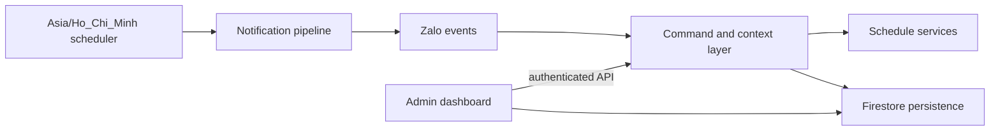

# ZaloBot

ZaloBot is a production-oriented Node.js bot for Lạc Hồng University schedules. It retrieves student, teacher, exam, and room data, persists runtime state in Firestore, delivers scheduled notifications in Vietnam time, and exposes an authenticated administration dashboard.

## Features

- Student, weekly, exam, teacher, and empty-room schedule queries.
- Daily schedule, schedule-change, class-start, birthday, and broadcast notifications.
- Per-user and per-chat MSSV context with separate private/group records.
- Firestore-backed persistence with legacy JSON migration support.
- Authenticated admin dashboard and command console backed by the same bot command engine.
- Access control, chat health tracking, bounded delivery retries, and operational audit logs.
- File-based Firebase configuration with a single downloaded service-account JSON.

## Architecture



The runtime starts by hydrating Firestore state, then starts the admin HTTP server, the scheduler, and Zalo polling. `recent_json/` is migration input only; it is never authoritative at runtime.

Startup order is fixed so no scheduled work runs on empty state:

```text
load environment
-> initialize Firebase
-> load Firestore state
-> reconcile required state
-> start dashboard
-> start schedulers
-> start Zalo polling
```

If Firebase/Firestore initialization fails, startup stops with a non-zero exit code and neither the scheduler nor Zalo polling is started. Production never falls back to local JSON storage; local JSON remains available for migration and tests only.

## Prerequisites

- Node.js LTS (64-bit recommended) and npm.
- Firebase project with Firestore enabled and a service account with read/write access to the configured state collection.
- Zalo Bot token.
- Optional Gemini API key and Discord webhook.
- Windows Server 2019+, Linux, or another Node.js-supported OS.

## Installation

```bash
git clone https://github.com/NAUTH05/ZaloBot
cd ZaloBot
npm install
```

Create the environment file:

```bash
cp .env.example .env       # Linux/macOS
```

```cmd
copy .env.example .env     REM Windows CMD
```

```powershell
Copy-Item .env.example .env   # PowerShell
```

## Firebase setup

ZaloBot prefers **one downloaded Firebase Admin JSON configuration file**. Separate project/email/key fields are no longer required.

1. Open the [Firebase Console](https://console.firebase.google.com/).
2. Create a project or select an existing one.
3. Open **Firestore Database** in the left menu.
4. Click **Create database**.
5. Select a region and finish creation.
6. Open **Project settings** (gear icon).
7. Open the **Service accounts** tab.
8. Click **Generate new private key** (Firebase Admin SDK configuration file).
9. Download the JSON file.
10. Rename it to:

    ```text
    zalobot-firebase-adminsdk-fbsvc.json
    ```

11. Place it in the project root.

```text
ZaloBot/
├── admin-ui/
├── main.js
├── firestorePersistence.js
├── ecosystem.config.cjs
├── .env
├── .env.example
├── zalobot-firebase-adminsdk-fbsvc.json
├── package.json
└── README.md
```

This local configuration file must stay outside Git. `.gitignore` already excludes `.env`, `firebase-service-account.json`, and every `*firebase-adminsdk*.json` file. Keep the file outside the repository when the host supports it (for example `C:\Secure\ZaloBot\...` or `/etc/zalobot/...`).

The configuration file path supports relative and absolute paths. Relative paths resolve from the project directory, so the bot behaves the same regardless of the directory PM2 is started from:

```js
const configuredPath = process.env.FIREBASE_SERVICE_ACCOUNT_FILE;

const resolvedPath = path.isAbsolute(configuredPath)
    ? configuredPath
    : path.resolve(projectRoot, configuredPath);
```

Before Firebase starts, the file is validated. Clear errors are reported for a missing path, a missing file, invalid JSON, missing required fields, and a Firebase initialization failure. The content of the JSON file is never printed to the logs.

## Environment setup

Firebase example:

```env
FIREBASE_SERVICE_ACCOUNT_FILE=./zalobot-firebase-adminsdk-fbsvc.json
FIREBASE_DATABASE_ID=(default)
FIREBASE_STATE_COLLECTION=bot_state
```

Absolute path examples:

```env
# Linux/macOS
FIREBASE_SERVICE_ACCOUNT_FILE=/home/zalobot/zalobot-firebase-adminsdk-fbsvc.json
```

```env
# Windows
FIREBASE_SERVICE_ACCOUNT_FILE=C:\Secure\ZaloBot\zalobot-firebase-adminsdk-fbsvc.json
```

`FIREBASE_DATABASE_ID` selects the Firestore database. `(default)` uses the default database; any other value selects that named database through the Firebase Admin API. Migration and runtime always use the same project, database, and collection.

### Configuration groups

| Group | Variables |
| --- | --- |
| Zalo | `BOT_TOKEN`, `CHAT_MAX_CONSECUTIVE_FAILURES` |
| Owner IDs | `OWNER_USER_ID`, `OWNER_CHAT_ID` |
| Dashboard | `ADMIN_USERNAME`, `ADMIN_PASSWORD`, `ADMIN_PASSWORD_HASH`, `ADMIN_PORT`, `ADMIN_BASE_PATH`, `ADMIN_COOKIE_SECURE` |
| Discord | `DISCORD_WEBHOOK` |
| Gemini | `GEMINI_API_KEY`, `GEMINI_MODEL` |
| Firebase | `FIREBASE_SERVICE_ACCOUNT_FILE`, `FIREBASE_DATABASE_ID`, `FIREBASE_STATE_COLLECTION` |
| Runtime | `TZ`, `NODE_ENV`, `PORT`, `CLASS_START_GRACE_MS`, `CLASS_START_CACHE_TTL_MS`, `SHUTDOWN_TIMEOUT_MS` |

`OWNER_USER_ID` and `OWNER_CHAT_ID` accept comma-separated identities. `ADMIN_PORT` falls back to `PORT`, then `6003`. `TZ` must remain `Asia/Ho_Chi_Minh`. `SHUTDOWN_TIMEOUT_MS` must stay below the PM2 `kill_timeout`.

### Obtaining owner IDs

1. Start the bot once with any valid `BOT_TOKEN` (owner IDs may be empty at first).
2. Send `/myid` from the account that should be the owner.
3. Copy the returned **User ID** into `OWNER_USER_ID` and the **Chat ID** into `OWNER_CHAT_ID`.
4. Restart the bot.

Owner IDs can also be managed from the dashboard (**Settings -> Admins**) without editing `.env`.

## Development run

```bash
npm start
npm test
npm run build:admin
npm run verify:firebase-admin
```

Useful scripts:

| Script | Purpose |
| --- | --- |
| `npm start` | Run the bot (`node main.js`). |
| `npm test` | Run the Node test suite. |
| `npm run admin:hash-password` | Generate `ADMIN_PASSWORD_HASH` from `ADMIN_PASSWORD_TO_HASH`. |
| `npm run migrate:firestore` | Import `recent_json/` into Firestore. |
| `npm run verify:firebase-admin` | Check Firebase credentials and Firestore access. |
| `npm run build:admin` | Verify the dashboard assets are present. |

There is no build step; the bot runs directly from source.

## Migration

`recent_json/` holds legacy JSON state. Import it once with:

```bash
npm run migrate:firestore
```

The migration uses exactly the same Firebase configuration as the runtime:

```env
FIREBASE_SERVICE_ACCOUNT_FILE=./zalobot-firebase-adminsdk-fbsvc.json
FIREBASE_DATABASE_ID=(default)
FIREBASE_STATE_COLLECTION=bot_state
```

A custom source folder can be passed as an argument:

```bash
node migrateToFirestore.js /path/to/json-folder
```

The migration reports a clear error and exits with a non-zero code when the source folder is missing, a JSON file is invalid, Firebase setup fails, or no JSON file is found.

## PM2 production deployment

```bash
npm install -g pm2

npm install
npm test

pm2 start ecosystem.config.cjs
pm2 status
pm2 logs zalobot
pm2 save
pm2 startup
```

**ZaloBot must run as one process only.** `ecosystem.config.cjs` sets `instances: 1` and `exec_mode: "fork"`. Do not use cluster mode: multiple instances would duplicate Zalo polling, scheduled tasks, notifications, and dashboard listeners.

PM2 settings used by this project:

| Setting | Value | Reason |
| --- | --- | --- |
| `name` | `zalobot` | Stable process name for logs and restarts. |
| `instances` / `exec_mode` | `1` / `fork` | Exactly one runtime, no duplicated polling. |
| `autorestart` / `max_restarts` | `true` / `10` | Automatic recovery with a restart cap. |
| `restart_delay` | `5000` | Avoid tight restart loops. |
| `min_uptime` | `30s` | Treat fast crashes as failed starts. |
| `kill_timeout` | `15000` | Allows pending Firestore writes to flush. |
| `max_memory_restart` | `512M` | Recycle on memory growth. |
| `time` | `true` | Timestamps in PM2 logs. |
| `cwd` | project directory | Relative `.env` and credential paths resolve correctly. |

### Update workflow

```bash
cd /path/to/ZaloBot
git pull
npm install
npm test
pm2 restart zalobot --update-env
pm2 status
pm2 logs zalobot
```

`--update-env` is required after changing `.env`; without it PM2 keeps the previous environment.

### Clean shutdown

The runtime handles `SIGINT` and `SIGTERM` (what `pm2 restart` / `pm2 stop` send). Shutdown runs only once and then:

1. cancels node-schedule jobs;
2. stops Zalo polling when the library exposes a stop API;
3. closes the dashboard HTTP server;
4. awaits `flushPersistenceWrites()`;
5. exits with code `0`, or with code `1` when `SHUTDOWN_TIMEOUT_MS` is exceeded.

## Admin dashboard

The dashboard listens only on `127.0.0.1:${ADMIN_PORT}${ADMIN_BASE_PATH}/` and is protected by an HttpOnly, SameSite session cookie. It provides overview health, chat directory, users and MSSV, subscriptions, command execution, settings, logs, and audit history. The console calls the same backend command engine; it does not duplicate business logic.

Dashboard sessions are kept in memory. A PM2 restart requires signing in again, which is expected.

### Reverse proxy (Nginx / CloudPanel / IIS)

Expose the dashboard through the reverse proxy instead of binding Node to a public interface. Keep the Node process on localhost.

Nginx example:

```nginx
location /zalobot/ {
    proxy_pass http://127.0.0.1:6003/zalobot/;
    proxy_http_version 1.1;
    proxy_set_header Host $host;
    proxy_set_header X-Forwarded-Proto $scheme;
    proxy_set_header X-Forwarded-For $proxy_add_x_forwarded_for;
}
```

- Keep `ADMIN_BASE_PATH` aligned with the proxy location (`/zalobot` by default).
- Keep `ADMIN_COOKIE_SECURE=true` when the dashboard is served over HTTPS.
- The production subdomain is `https://zalobot.mrnauthdev.dpdns.org/`.
- For Windows Server/IIS follow [deployment/windows/README.md](deployment/windows/README.md).

## Firestore data structure

Runtime state is stored as JSON payloads in a single collection (`bot_state` by default), one document per store:

```text
bot_state
├── subscriptions
├── interactions
├── scheduleSnapshots
├── classStartNotifications
├── birthdayData
├── accessControl
├── chatDirectory
├── adminAudit
├── adminLogs
└── adminSettings
```

Each document stores `{ payload: "<json>", updatedAt: "<iso>" }`. Writes are serialized through a queue and retried three times; failures are surfaced in the dashboard persistence status and in the logs. `flushPersistenceWrites()` awaits the queue and is called during normal shutdown.

`bot_state/dutyScheduleData` is **not** listed above: the Room 411 duty feature was extracted into a separate bot that now owns that document exclusively. This bot neither hydrates nor writes it, and `importJsonDirectory()` skips it so a JSON migration can never overwrite the extracted data. See [Room 411 bot](#room-411-bot-separate-project).

## Help command structure

```text
/help       normal user commands
/helpadmin  management commands (owner only)
```

All help content lives in `helpContent.js` as reusable metadata:

```js
const HELP_COMMANDS = [
    {
        command: "find",
        usage: "/find [MSSV]",
        description: "Lưu MSSV để dùng cho các lệnh lịch.",
        examples: ["/find 123000135"],
        note: "Lệnh này chỉ lưu MSSV, không tự bật thông báo."
    }
];
```

The same metadata feeds `/help`, `/helpadmin`, the dashboard "Available commands" list, and autocomplete, so documentation cannot drift from the code. Every documented command includes syntax, a short description, at least one example, and a short note when useful.

Both help outputs render each command as one compact, consistent block — usage first, then the description, then `(Ví dụ: ...)` and `(Lưu ý: ...)` when present:

```text
**/find [MSSV]**
Lưu MSSV để dùng cho các lệnh lịch.
(Ví dụ: /find 123000135)
(Lưu ý: Lệnh này chỉ lưu MSSV, không tự bật thông báo.)
```

Blocks are separated by a blank line so the existing `sendMessage()` chunker still splits long help output on entry boundaries.

Public `/help` is grouped by category:

```text
# ZALOBOT HƯỚNG DẪN

## BẮT ĐẦU        /start, /find
## LỊCH HỌC       /lich, /lichtuan, /lichthi, /lichgv, /phongtrong
## THÔNG BÁO      /dangky, /danhsachdangky, /suadangky, /xoadangky,
                  /huythongbao, /batnhaclich, /tatnhaclich, /trangthainhaclich
## SINH NHẬT      /sinhnhat
## TIỆN ÍCH       /ai, /time, /myid
## TRỢ GIÚP       /help
```

## Room 411 bot (separate project)

The internal Room 411 duty-schedule feature no longer lives in this repository. It was extracted into a separate, self-contained bot that runs as its own process with its own codebase, package, PM2 entry and tests.

| | ZaloBot (this project) | Room 411 bot |
| --- | --- | --- |
| Purpose | LHU class schedules, birthdays, broadcasts, access control, chat management | Room 411 duty roster and the 06:00 daily duty notification |
| Firestore | Same project and database | Same project and database |
| Owns (writes) | `subscriptions`, `interactions`, `scheduleSnapshots`, `classStartNotifications`, `birthdayData`, `accessControl`, `chatDirectory`, `adminAudit`, `adminLogs`, `adminSettings` | `dutyScheduleData` |
| Reads | Its own stores | `chatDirectory` (read-only) |

This bot does not read or write `dutyScheduleData`, does not schedule any 06:00 duty job, and does not expose duty endpoints or a Duty dashboard tab. Existing Room 411 records in Firestore are left untouched for the new bot to pick up.

Migration, cutover order, and rollback steps are documented in the Room 411 bot's `docs/CUTOVER.md`; data ownership rules are in its `docs/DATA_OWNERSHIP.md`.

## Bot commands

Public commands: `/start`, `/find`, `/lich`, `/lichtuan`, `/lichthi`, `/lichgv`, `/phongtrong`, `/ai`, `/dangky`, `/danhsachdangky`, `/suadangky`, `/xoadangky`, `/huythongbao`, `/batnhaclich`, `/tatnhaclich`, `/trangthainhaclich`, `/sinhnhat`, `/time`, `/myid`, `/help`. Run `/help` for syntax and examples.

Owner commands cover access control, chat health, birthday Q&A, broadcasts, and delivery tests; `/helpadmin` lists the complete owner-only set.

### Broadcast versus update announcements

Both commands are owner-only and share the same target selection, eligibility rules, delivery handling, and sent/failed summary (`sendBotAnnouncement`). They differ only in intent and heading:

| Command | Heading | Use it for |
| --- | --- | --- |
| `/thongbao [Nội dung thông báo]` | `[THÔNG BÁO CHUNG]` | General broadcasts that are not product or bot updates. |
| `/update [Nội dung cập nhật]` | `[THÔNG BÁO CẬP NHẬT]` | Product or bot update announcements. |

Neither command bypasses chat preferences: `getBroadcastTargets()` still filters every target through `isChatEligible(chatId, "broadcast")`, and each command sends exactly one message per target. Running one command never triggers the other.

## Timezone

The application and every scheduled rule use `Asia/Ho_Chi_Minh`. Do not rely on the host operating system timezone.

## Troubleshooting

| Symptom | Fix |
| --- | --- |
| Firebase configuration file missing | Set `FIREBASE_SERVICE_ACCOUNT_FILE` in `.env` and confirm the path resolves from the project directory. |
| Invalid Firebase JSON | Re-download the Admin SDK file; do not hand-edit it. The startup error names the file but never prints its content. |
| Firebase project cannot be detected | Confirm `project_id` inside the JSON matches the intended project, then run `npm run verify:firebase-admin`. |
| Wrong Firestore database ID | Check `FIREBASE_DATABASE_ID`; use `(default)` unless a named database exists. |
| Firestore database missing | Create the Firestore database in the Firebase Console and select its region. |
| Old bot data not appearing | Run `npm run migrate:firestore` with the same Firebase configuration as the runtime. |
| BOT configuration missing | The process exits at startup when `BOT_TOKEN` is absent. Set it in `.env`. |
| Polling issues | Check `pm2 logs zalobot` for `polling_error`; transient `408` responses are ignored by design. |
| Dashboard unavailable | Verify `ADMIN_PORT`, `ADMIN_BASE_PATH`, that the process listens on `127.0.0.1`, and the reverse proxy settings. |
| PM2 restart loop | Read `pm2 logs zalobot`; the most common cause is an invalid or missing Firebase configuration file. |
| New `.env` values not loaded | Run `pm2 restart zalobot --update-env`. |
| Dashboard port already used | Change `ADMIN_PORT` (or `PORT`) and restart; check the port owner first. |
| Firebase works manually but not through PM2 | PM2 keeps its own environment. Ensure `.env` sits in the project directory and restart with `--update-env`. |
| Duplicate notifications | Run `pm2 list` and ensure exactly one `zalobot` process is online; never use cluster mode. |

Additional checks:

```bash
node --check main.js
node --check firestorePersistence.js
node --check ecosystem.config.cjs
npm run verify:firebase-admin
pm2 status
```

Windows/IIS specifics: `500.19` usually means a malformed `web.config` or missing URL Rewrite; `500.50/500.52` indicates rewrite/ARR configuration; `502.3` means IIS cannot reach Node; `525` indicates an origin TLS or binding problem. Confirm Cloudflare SSL/TLS is **Full (strict)** and the IIS certificate matches the hostname.

## Security

Keep `.env`, Firebase keys, bot tokens, passwords, and cookies outside source control. Prefer `ADMIN_PASSWORD_HASH` and an external `FIREBASE_SERVICE_ACCOUNT_FILE`. Restrict service-account file permissions to the deployment account, expose only TCP 443 publicly, and keep Node bound to localhost.

## Development

Use `dev` for platform-neutral application work and `dev_windows` for the Windows deployment edition. Run the test suite and `npm run build:admin` before commits. Keep command logic in the backend and add regression tests for behavior changes.

## Admin dashboard notes

The admin dashboard supports consistent pagination for growing lists and a persisted default rows-per-page setting. Its Available commands view, autocomplete, and bot help metadata are derived from the centralized command registry. Manual commands execute as the authenticated admin session; optional target IDs remain separate and are validated by the existing command engine.
