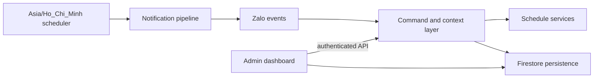

# ZaloBot

ZaloBot is a production-oriented Node.js bot for Lạc Hồng University schedules. It retrieves student, teacher, exam, and room data, persists runtime state in Firestore, delivers scheduled notifications in Vietnam time, and exposes an authenticated administration dashboard.

## Features

- Student, weekly, exam, teacher, and empty-room schedule queries.
- Daily schedule, schedule-change, class-start, duty, birthday, and broadcast notifications.
- Per-user and per-chat MSSV context with separate private/group records.
- Firestore-backed persistence with legacy JSON migration support.
- Authenticated admin dashboard and command console backed by the same bot command engine.
- Access control, chat health tracking, bounded delivery retries, and operational audit logs.

## Architecture



The runtime starts by hydrating Firestore state, then starts the admin HTTP server, scheduler, and Zalo polling. `recent_json/` is migration input only; it is never authoritative at runtime.

## Requirements

- Node.js LTS (64-bit recommended) and npm.
- Firebase project with Firestore enabled and a service account with read/write access to the configured state collection.
- Zalo Bot token.
- Optional Gemini API key and Discord webhook.
- Windows Server 2019+, Linux, or another Node.js-supported OS.

## Installation

```bash
git clone https://github.com/NAUTH05/ZaloBot
cd ZaloBot
npm ci
copy .env.example .env   # Windows
cp .env.example .env     # Linux/macOS
```

Set `BOT_TOKEN`, an owner identity, and Firebase credentials before starting. Never commit `.env` or a service-account JSON file.

## Configuration

### Zalo

`BOT_TOKEN` is required. `OWNER_USER_ID` and `OWNER_CHAT_ID` accept comma-separated administrator identities. `CHAT_MAX_CONSECUTIVE_FAILURES` controls temporary delivery suspension.

### Firebase

Use either `FIREBASE_SERVICE_ACCOUNT_FILE` (preferred, especially on Windows) or the compatible `FIREBASE_SERVICE_ACCOUNT_PATH`, or provide `FIREBASE_PROJECT_ID`, `FIREBASE_CLIENT_EMAIL`, and `FIREBASE_PRIVATE_KEY`. `FIREBASE_DATABASE_ID` defaults to `(default)` and `FIREBASE_STATE_COLLECTION` defaults to `bot_state`.

### Admin and server

`ADMIN_USERNAME`, `ADMIN_PASSWORD_HASH` (preferred) or `ADMIN_PASSWORD`, `ADMIN_PORT` (defaults to `PORT` then `6003`), `PORT` (defaults to `3000`), `ADMIN_BASE_PATH` (defaults to `/zalobot`), and `ADMIN_COOKIE_SECURE`.

### Scheduler and optional services

`TZ` must remain `Asia/Ho_Chi_Minh`. `CLASS_START_GRACE_MS` and `CLASS_START_CACHE_TTL_MS` tune class reminders. `GEMINI_API_KEY`, `GEMINI_MODEL`, and `DISCORD_WEBHOOK` are optional.

## Running and testing

```bash
npm start
npm test
npm run build:admin
npm run verify:firebase-admin
```

Generate a password hash with `npm run admin:hash-password`. Migrate legacy JSON once with `npm run migrate:firestore`.

## Bot commands

User commands include `/find`, `/lich`, `/lichtuan`, `/lichthi`, `/lichgv`, `/phongtrong`, `/ai`, `/dangky`, `/danhsachdangky`, `/suadangky`, `/xoadangky`, `/huythongbao`, `/batnhaclich`, `/tatnhaclich`, `/trangthainhaclich`, `/lichtruc`, `/danhsachlichtruc`, `/dangkylich`, `/huydangkylich`, `/sinhnhat`, `/time`, `/myid`, `/help`, and `/help411`. Use `/help` for syntax and examples.

Owner commands cover access control, chat health, birthday Q&A, duty management, broadcasts, and delivery tests; `/helpadmin` lists the complete owner-only set.

## Admin dashboard

The dashboard is served at `http://127.0.0.1:${ADMIN_PORT}${ADMIN_BASE_PATH}/` and is protected by an HttpOnly, SameSite cookie session. It provides overview health, chat directory, users and MSSV, subscriptions, duty schedules, command execution, settings, logs, and audit history. The console calls `handleCommand` in the backend; it does not duplicate business logic.

## Firestore and notifications

State documents include `subscriptions`, `classStartNotifications`, `interactions`, `scheduleSnapshots`, `dutyScheduleData`, `birthdayData`, `accessControl`, `chatDirectory`, `adminAudit`, `adminLogs`, and `adminSettings`. Writes are serialized and retried three times; a failed write is surfaced in dashboard persistence status and logs.

All scheduler jobs use `Asia/Ho_Chi_Minh`: daily schedules, weekly change detection, class-start reminders, duty notifications, birthdays, and broadcasts. Stable event keys prevent duplicate class reminders and publication messages across retries or restarts.

## Timezone

The application and every scheduled rule use `Asia/Ho_Chi_Minh`. Do not rely on the host operating system timezone.

## Deployment

For Linux/VPS, run the Node process behind the existing reverse proxy and keep Firestore credentials in the service environment. For Windows Server, follow [deployment/windows/README.md](deployment/windows/README.md). The production subdomain is `https://zalobot.mrnauthdev.dpdns.org/` and proxies IIS/ARR to `127.0.0.1:3000`.

## Troubleshooting

1. Test Node directly: `Invoke-WebRequest http://127.0.0.1:3000/ -UseBasicParsing`.
2. Check `pm2 status` and `pm2 logs` when using PM2.
3. Verify Firebase with `npm run verify:firebase-admin`.
4. Check IIS, URL Rewrite, ARR proxy settings, and `C:\inetpub\logs\LogFiles` on Windows.
5. Confirm Cloudflare SSL/TLS is **Full (strict)** and the IIS certificate matches `zalobot.mrnauthdev.dpdns.org`.

Common IIS errors: `500.19` usually means malformed `web.config` or missing URL Rewrite; `500.50/500.52` indicates rewrite/ARR configuration; `502.3` means IIS cannot reach Node; `525` indicates an origin TLS or binding problem.

## Security

Keep `.env`, Firebase keys, bot tokens, passwords, and cookies outside source control. Prefer `ADMIN_PASSWORD_HASH` and an external `FIREBASE_SERVICE_ACCOUNT_FILE`. Restrict service-account NTFS permissions to the deployment account, expose only TCP 443 publicly, and keep Node bound to localhost.

## Development

Use `dev` for platform-neutral application work and `dev_windows` for the Windows deployment edition. Run the test suite and `npm run build:admin` before commits. Keep command logic in the backend and add regression tests for behavior changes.
